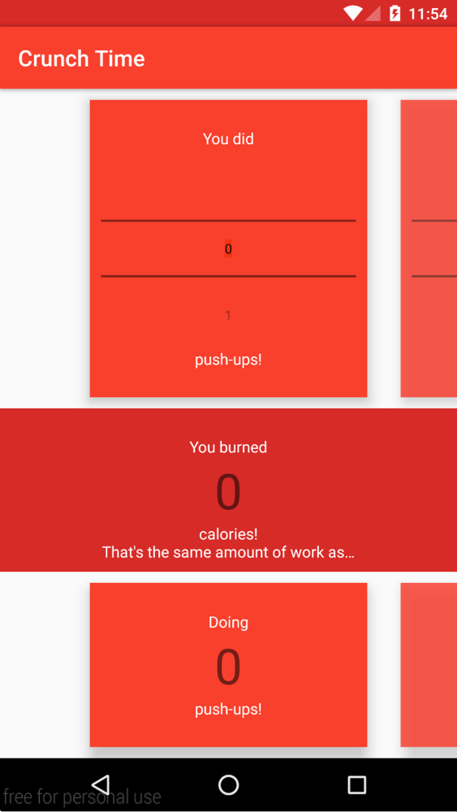
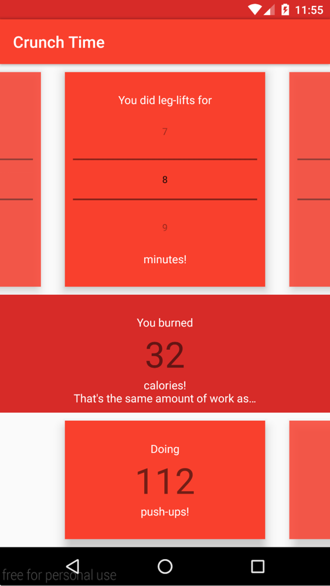
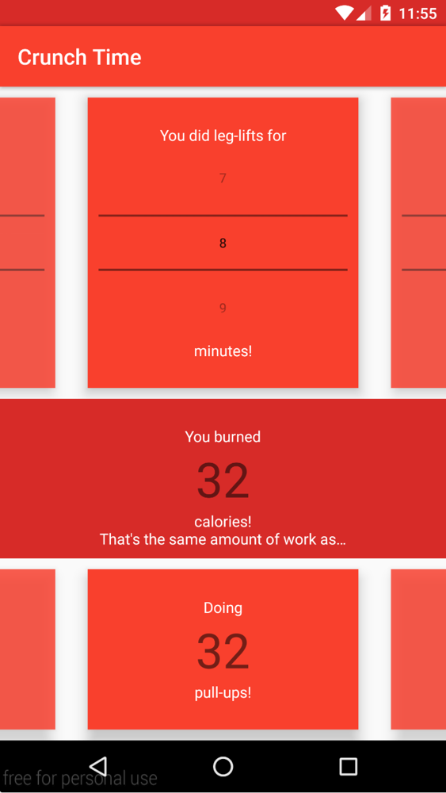

# PROG 01: Crunch Time

Crunch Time is a very simple app which, given a length/number of reps of an exercise, lists the approximate calories burned by doing said exercise, as well as how much of each other exercise would result in the same number of calories burned.

## Screenshots

Main screen:

Selecting different "target" exercises:

## Authors

Mario Guerrieri ([mario@guerrieri.me](mailto:mario@guerrieri.me))

## Demo Video

See [Crunch Time demo](https://www.youtube.com/watch?v=VnfPUK9rdVI) (YouTube)

## Acknowledgments

* After an hour or so of trying to figure out why my model objects weren't getting their `View` fields set to the `View`s that were actually shown in the interface, [this](http://stackoverflow.com/questions/2618272/custom-listview-adapter-getview-method-being-called-multiple-times-and-in-no-co) Stack Overflow post informed me that Android sometimes calls `Adapter.getView()` more than once per element in the `Adapter`. [This](http://stackoverflow.com/a/3727813/2205941) one gave me the solution (use `View.getChildAt()` to get the child `View`s from my `Gallery`s directly).